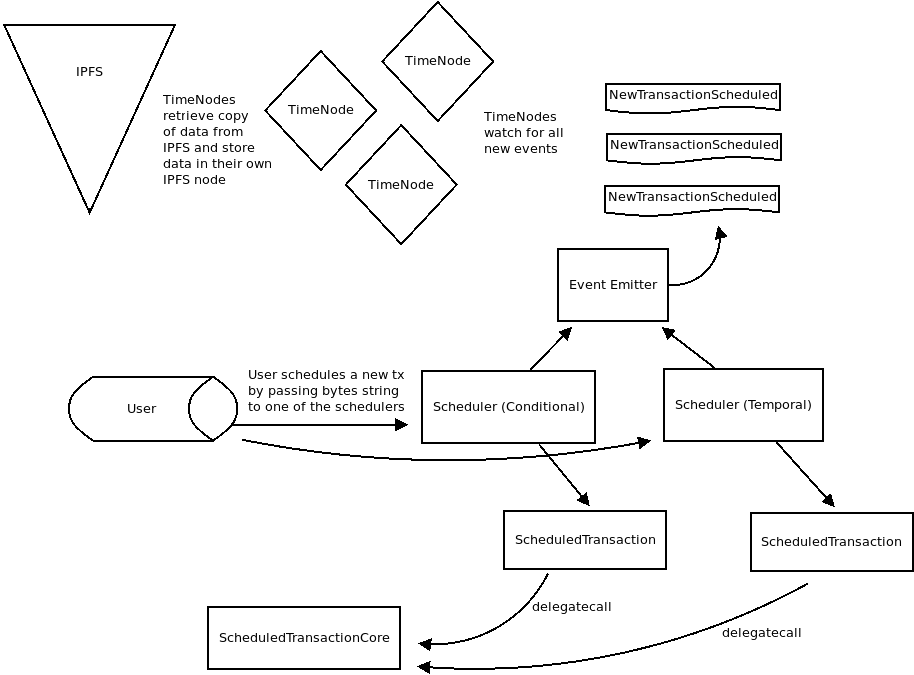

# _UNDER CONSTRUCTION_

### FAQ
[How does this use IPFS?](ipfs.txt)

### TODOs
 - [ ] write blog
 - [ ] add temporalUnit into encoding
 - [ ] document encoding
 - [ ] document IPFS use
 - [ ] Fix timenode to run IPFS node and read serialization
 - [ ] Claiming mechanism (using DAY ?) - to be determined
 - [ ] new docs (General Overview + dev docs)
 - [ ] multiplexer - to be determined
 - [ ] more tests... we need more tests ( just port all relevant v1 tests )
 - [ ] calculate the amount of gas used to execute, will be different numbers from before
